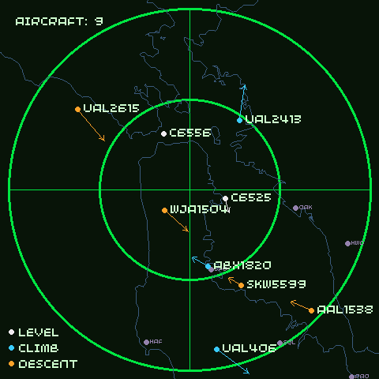

# Presto Radar

## What

Use a [Pimoroni Presto](https://shop.pimoroni.com/products/presto) to display a
radar-style visual of aircraft in the airspace near a point.

## How

* `cp prestoradar/settings_example.py prestoradar/settings.py`, then edit it -
  particularly `CENTER_LAT` and `CENTER_LON`. `settings.py` is gitignored (it's
  per-location); `settings_example.py` is the tracked template. `./deploy.sh`
  creates `settings.py` from the template on first run if it's missing.
* Generate a local base map with `python3 prestoradar/make_basemap.py --download`
  (the first run caches GSHHG coastline data and the OurAirports list; later
  runs can drop `--download`). Airport marks are filtered from OurAirports by
  size via `settings.BASEMAP_AIRPORTS` (`large`/`medium`/`small`/`none`);
  `--airports <tier>` overrides it for a one-off build. `basemap_data.py` is
  generated and gitignored; `./deploy.sh` rebuilds it when `settings.py` changes.
* Optional, for `DISPLAY_MODE = "map"`: bake a raster backdrop into
  `basemap.jpg`, which the radar decodes onto a background layer at boot and
  composites under the aircraft in place of the green grid.
  `python3 prestoradar/make_basemap.py --raster-fetch` fetches it from an
  ArcGIS World MapServer (`--raster-style topo/street/imagery`; no API key,
  standard library only) for exactly `CENTER_LAT/LON` +/- the radar frame.
  `--raster <your-map-image>` instead conforms an image you already have
  (needs Pillow). Regenerate by hand if the centre or radius changes;
  `./deploy.sh` copies whatever is there.
* Run `./radar_deploy.sh` from the top level to push the code
* Reset the Presto, either with eg `ampy reset --hard` or the physical button
* Select "Presto Radar" from the main menu (or eg `ampy run presto_radar.py`)

## Example

